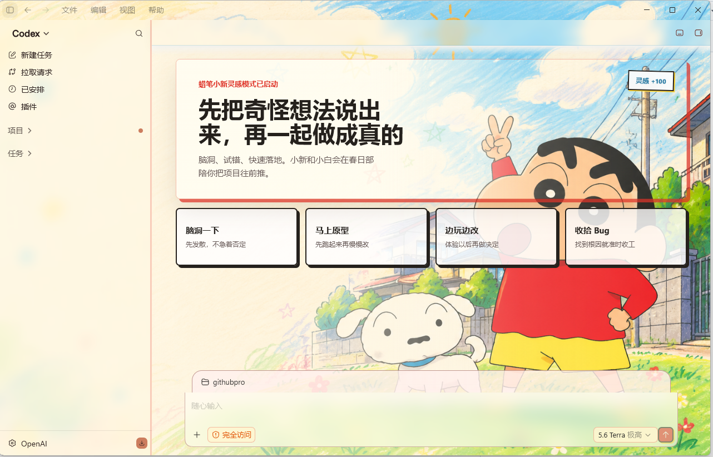

# Skin Codex



一个面向 Codex Desktop 的开源本地主题开发工具。主题由 CSS、JSON 和本地图片组成，通过本机回环 CDP 加载；不修改官方应用文件、`app.asar` 或签名。

当前公开的是纯开发版：不含商业 Runtime、加密/混淆实现、主题签名、公私钥或私有分发逻辑。你可以自由创建、编辑、导入和分享主题包。

## 独家赞助

<p align="center">
  <a href="https://useaifor.me/register?aff=J7F65KDMA542">
    
  </a>
</p>

<p align="center">
  <strong>AI 模型接入 · 更顺畅的开发体验</strong><br>
  <sub>灵活接入 · 兼容客户端 · 专注创作</sub>
</p>

<p align="center">
  感谢 <a href="https://useaifor.me/register?aff=J7F65KDMA542"><strong>useaifor.me</strong></a> 对本项目的支持。<br>
  面向开发者的 AI 模型接入服务，可按自己的工作流配置到 Codex 或其他兼容客户端。
</p>

<p align="center">
  <sub>换肤与 API 配置互相独立，本项目不会自动改写你的模型供应商设置。</sub>
</p>

## 快速开始（Windows）

```powershell
cd windows
powershell.exe -NoProfile -ExecutionPolicy Bypass -File .\scripts\install-dream-skin.ps1
```

详细用法、主题包结构和样例见 [windows/README.md](./windows/README.md)。

## 简单使用

1. 安装后请从桌面或开始菜单的 **Skin Codex** 启动；它会连接已安装的 Codex Desktop，并在右下角保留主题托盘入口。
2. 右键托盘图标可应用或暂停皮肤、更换背景图、导入主题包、保存当前主题，以及在“已保存主题”中切换或删除主题。
3. 收到主题包时，选择 **导入主题包** 并选取 `.zip`；导入后会自动应用，也可以从“已保存主题”随时切换回来。
4. 开发自己的主题时，可从 `samples/theme-packs/sample-b-plus-minimal` 复制一份开始，或使用仓库内的 [`skin-codex-theme-dev` Skill](./skills/skin-codex-theme-dev/)；主题包只使用 `theme.json`、CSS、JSON 和本地图片，不包含可执行脚本。

## 开源边界

- 仅使用本机 `127.0.0.1` CDP；不修改官方 Codex 安装目录。
- 主题包不可执行 JavaScript；引擎只提供受限的声明式接口。
- 仓库仅附带抽象或原创技术样例；请在提交主题素材前确认再分发权利。
- 旧商业化实现保留在维护者本地，未包含在公开历史中。

## 许可证

[MIT](./LICENSE)。Skin Codex 不是 OpenAI 官方产品；Codex 及相关商标归其权利人所有。
